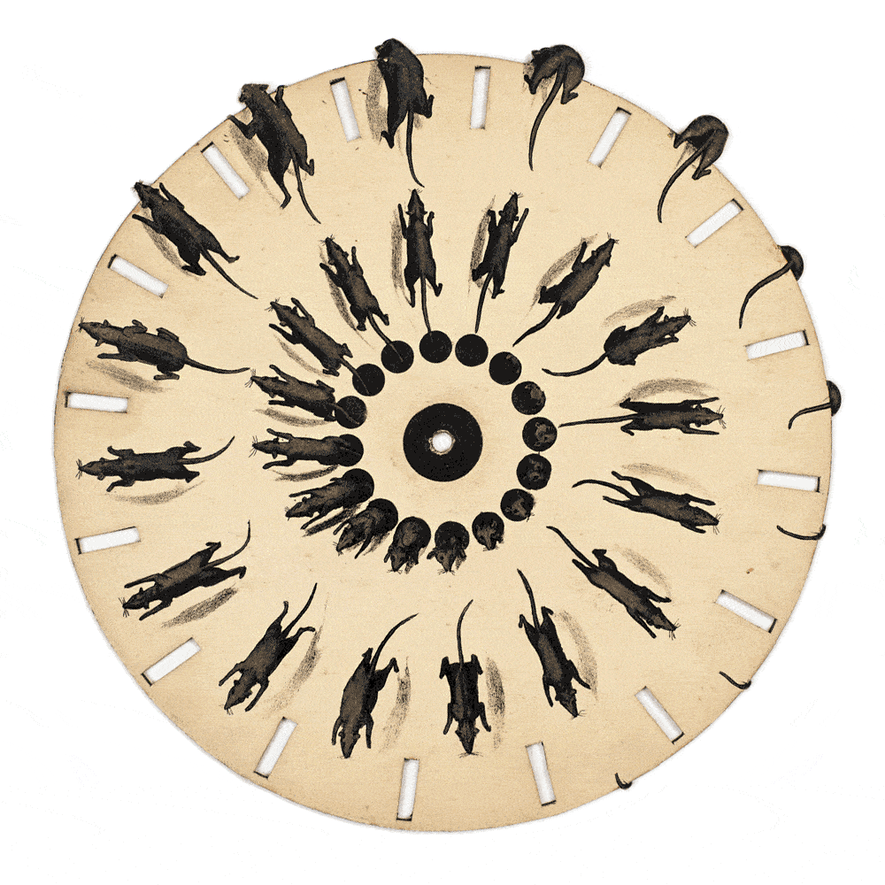

# IASC 2P03 Sample Project

## Abstract

This is an **abstract** text. It is typically *100 words* in length. It should be a clear and accurate summary of the project.

## Introduction

The **introduction** should include a detailed and meaningful context and history of the project. A reader should have a complete understanding of the current research in the field as well as the questions and hypotheses that will animate the current project.[1](#1)

> You will need to quote other researchers. For longer quotes, you can use the blockquote format like this. You can also link to websites [Source](https://duck.com)

## Methodology

Your **methodology** section may require you to list your activities, as they occurred chronologically:

1. Introduce Markdown
2. Demonstrate basic styling
3. Offer citation methods
4. Show how to integrate images
5. Git commit and push to remote repo

Your methodology may also include code examples or commands that should be formatted separately from your descriptive text

This is Python code:

```python
import antigravity
print("hello world")
# this is Python code
# notice the syntax highlighting!
```
This is HTML markup:
```html
<!DOCTYPE html>
<html>
    <head>My awesome page</head>
    <body>
        <p>Hello world!</p>
    </body>
</html>
```

## Results

Your results page will likely include the data visualizations and other *results* related to your project. You may include sample data or links to your tools. 

Static images can be embedded here to show results:




## Discussion

Your discussion section allows you to consider the impacts of your study. An unordered list is useful for this:

- Do you have policy recommendations? 
- What issues should future research take up? 
- What was an unexpected result of your research?

Your research should generate interesting and provocative questions. This section should be the most lively and animated section.

## References

Choose a citation style for your references. I recommend APA, Chicago, or MLA. We can link inside our document to sources like this: [Introduction](#introduction).

List notes like this:

##### 1 
Jane Doe, *An amazing title: A book worth studying*, (Important Publisher: Location, Year), 42.